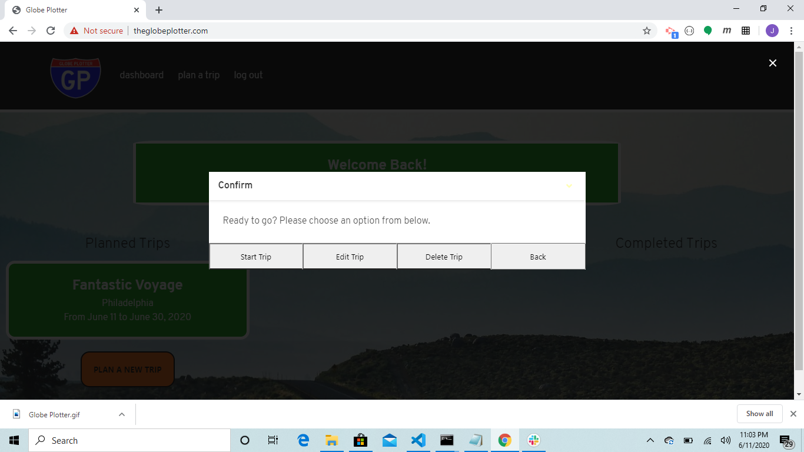
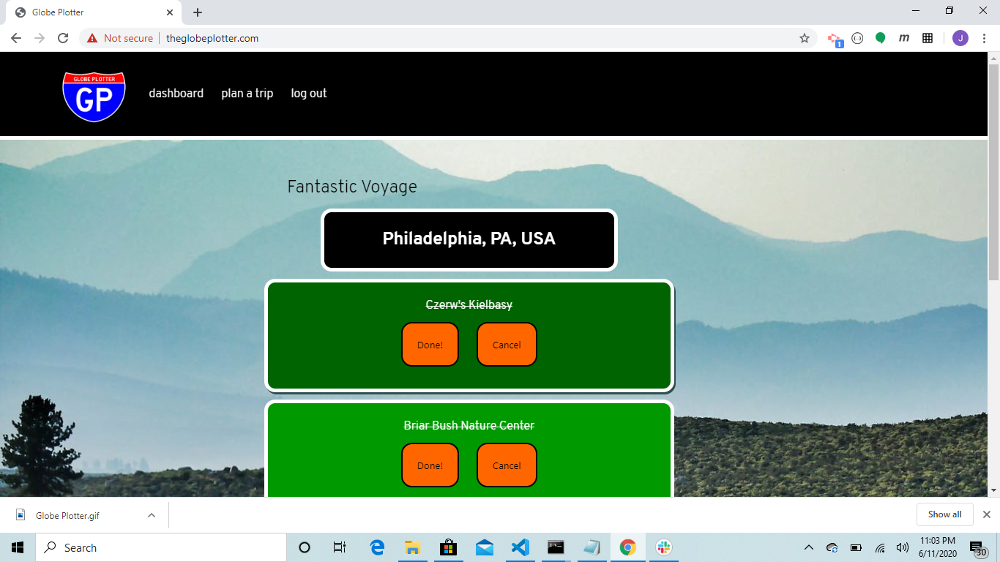

# Globe Plotter

Globe Plotter is a unique travel planning application. Globe plotter takes users through a short, semi-curated planning phase, generates a checklist for users to view during their trip, and finally allows the user to view their previously completed trips and activities, serving as a kind of retrospective, or small, digital photo album. A link to the deployed version can be found [here.](http://theglobeplotter.com/)
## Table of Contents

[Introduction](#introduction)  
[Installation](#installation)  
[Usage](#usage)  
[Contributing](#contributing)   
[About the Authors](#about-the-authors)  

## Introduction

  

Globe Plotter allows users to register or login using a password and a unique email. If the user does not successfully login or register, they are notified using a Bulma-toast. Once logged in, users are presented with their dashboard. Here they can view trips in all phases (in planning, in progress and completed). The app utilizes the Yelp API and the Google places APIs to help the user find cities to travel to, and activities within those cities. There are several tables in a sql db containing information about users, their trips, the cities within each trip, and the activities within each city. Each city and activity table also belongs to a single user, permitting stricter user validation, which is performed with passport. The front-end is designed with the Bulma framework, and with careful research into the colors and fonts used on highway signs, giving it a familiar feel.

## Installation

To use the app, simply navigate to the deployed webpage!

### Dependencies

In the front-end, the app uses the Bulma CSS Framework, Axios, the Google Places API, Animate CSS, and the Bulma-Toasts plugin. In the back-end, it uses express, express-handlebars for creating views templates, sequelize, passport for managing user authentication, dotenv for housing environment variables, bcryptjs for hashing passwords, and mysql2.

## Usage

To use the application, first sign up using an email address and a password. The password should be at least 8 characters long, but no more than 16. Then click either "plan a trip" in the navbar, or the new trip button on the dashboard. You will need to enter a name for your trip, and select a start and end date. From here, you can search for cities. Once you add a city, you will be prompted with 5 different activities from the Food category on Yelp to select from. These represent the 5 highest ranked options that Yelp has data on. Once you make a selection, you will be prompted with a different category. At any time, you can select 'Done' to return to the dashboard. From the dashboard, you can edit existing trips, or start them. Once you start a trip, the trip will move to the in-progress phase. From here, you can click on the trip and use it as a checklist during your journey. Each activity can also be expanded for more information on that activity. Finally, once all of the activities on the activities page are complete, you can move the trip to the completed phase. Here, you can view photos of all the places you've visited.

## Contributing

If you notice any errors in the code, please submit a github issue. 

## About the Authors

Adam Parsons, Dan McKeon and Joe Dvorak

UI and UX design, front-end HTML, CSS, JS code: Dan McKeon

API Integration, front-end JS, and html routes: Joe Dvorak

Database, api routes, and server construction: Adam Parsons

While these were the primary functions of each group member, we all worked together on every level of the application. It was a collaborative effort in the truest sense. 

README generated by GeneREADME. Original template written with [StackEdit](https://stackedit.io/). Badges provided through shields.io.
